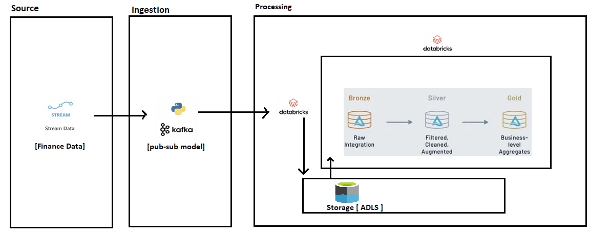

# Real Time Data Loading using Kafka
## Introduction
in this project we are mainly interested in building end-to-end Data engineering pipeline using Confluent Kafka and Azure services.

## Architecture

## Technology Used
1. Programming Language - Python
2. Azure Cloud Services
   - Azure Databricks
   - Azure ADLS Gen2
3. Confluent Kafka
4. Apache Spark

## Dataset Used
You can use any dataset or Rest API/Endpoint. I have generated dummy data using below python script to get streaming data environment.

[dummy data generator file](generate-data.py)

## Publish Operation in Kafka
Writing data to Kafka topic.
In this project we have written python script for publishing data to Kafka Topic.

[kafka producer](kafka_producer.py)

## Consumer Operation in Kafka
Reading data from Kafka topic.
We will be using Azure Databricks to perform this operation and store it into ADLS.

[kafka consumer](Kafka_consumer.ipynb)

